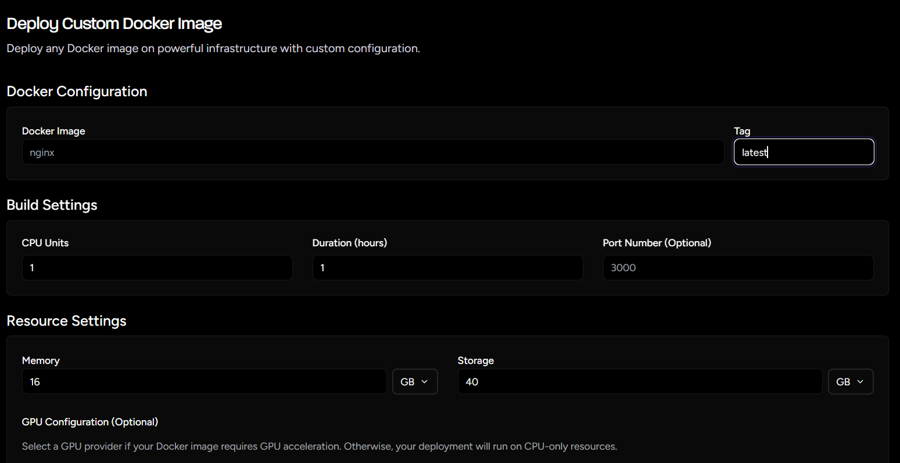

Deploy your custom applications using Docker containers on Aquanode's infrastructure with flexible resource allocation and GPU support.

## Deployment Process

### Step 1: Access Docker Deployment

Navigate to [Docker Deployment](https://console.aquanode.io/workloads/services/docker)

### Step 2: Select Docker Image Tab

Select the Docker Image tab to begin configuring your container deployment.

### Step 3: Configure Your Docker Deployment

You'll see a configuration page where you can enter your desired settings:

#### A. Docker Configuration

- **Docker Image**: Specify the container image to deploy
- **Image Tag**: Select the specific version/tag of your image
- **Environment Variables**: Configure runtime environment settings
- **Command Override**: Custom startup commands if needed

#### B. Port Configuration

Configure network access for your application:

- **Container Ports**: Ports your application exposes
- **Public Access**: Make your application accessible from the internet

#### C. Machine Configuration

- **GPU Selection**: Choose from our wide variety of available GPUs
- **CPU & Memory**: Allocate virtual cores and RAM
- **Storage Configuration**: Storage for your application data

### Step 4: Deploy Custom Instance

Review your configuration and click deploy.

You are good to go!