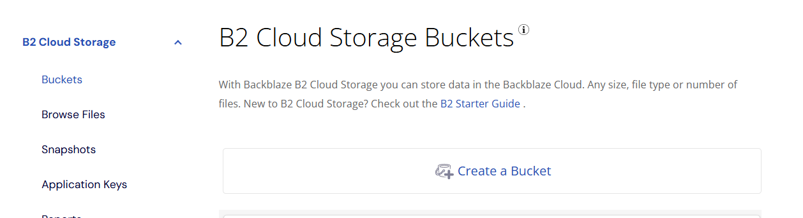
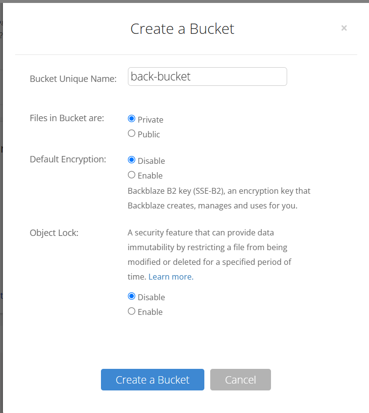
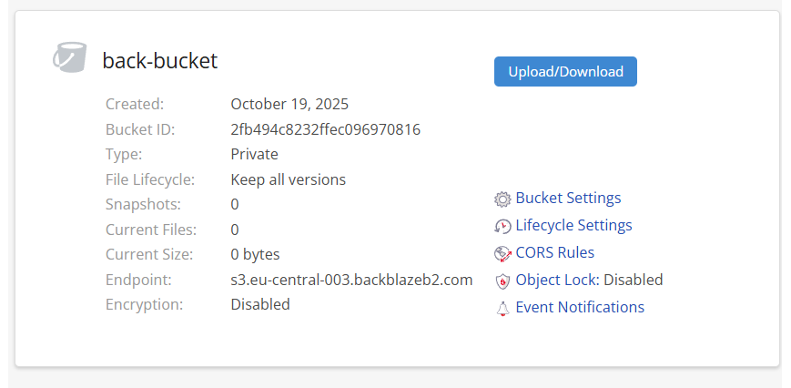
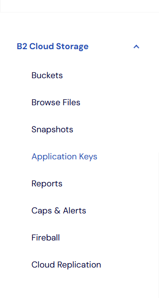
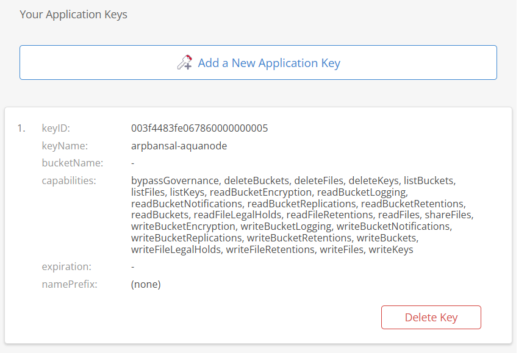
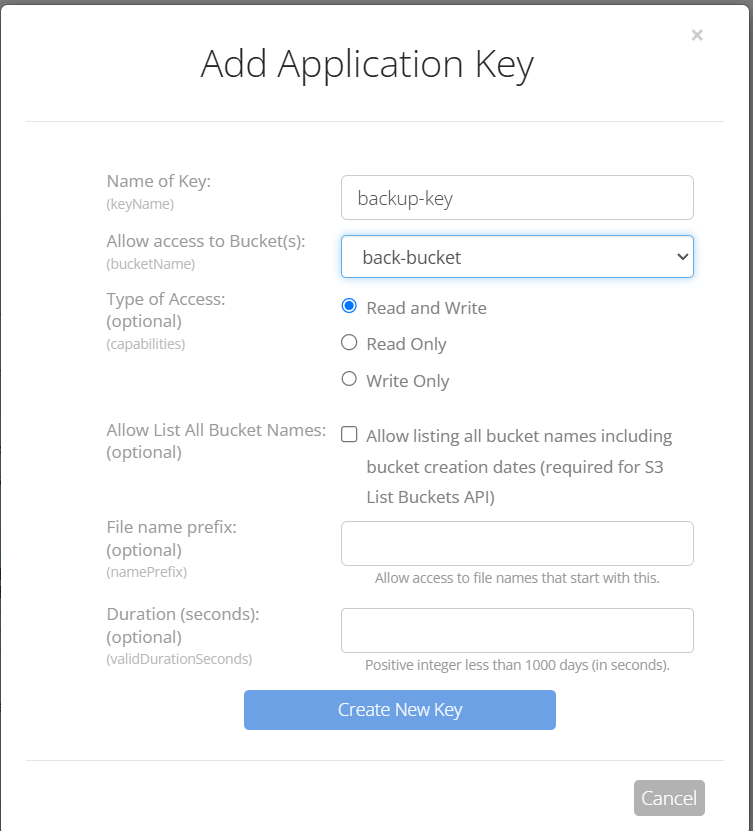
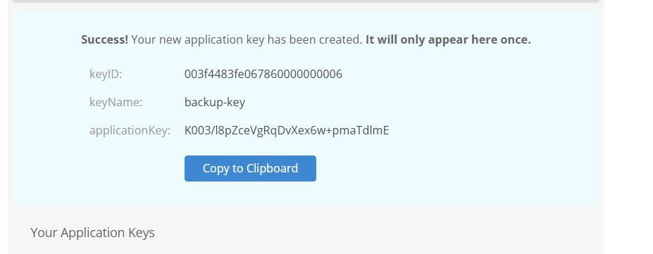

# Setup

A guide to setup the backblaze and get your keys

## Create a Bucket

Here you can see the:

This is s3-compatible endpoint

**EndPoint**: s3.eu-central.backblazeb2.com

**Region**: eu-central

## Create Application keys

Go To

Choose Application keys and then *Add a New Application Key*

Choose the appropriate bucket you want to give access to.
Make sure:

*Type of Access* : Read and write both

Avoid configuring other options

!!Hurray we got the keys

We already got:

**EndPoint**: **s3.eu-central.backblazeb2.com**

**Region**: **eu-central**

**Bucket Name** (that we set): **back-bucket**