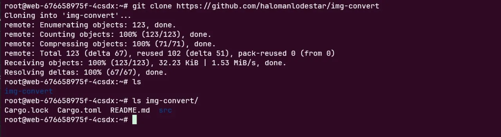
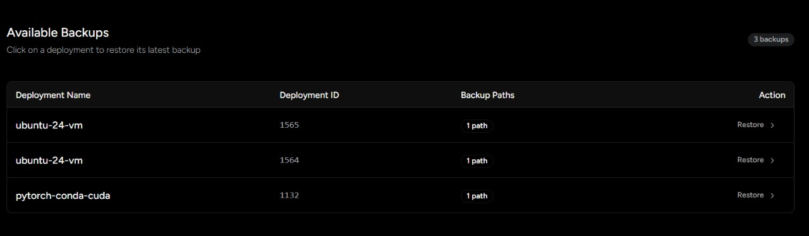
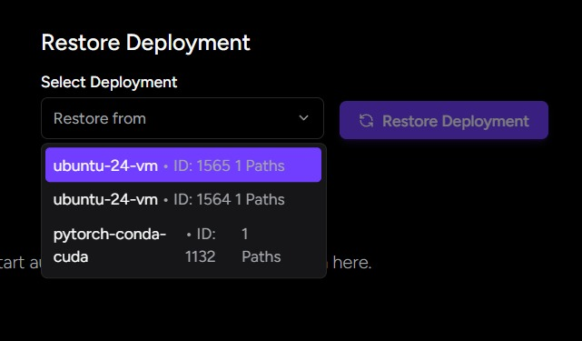

## VM-deployment-template

Choose your already saved credentials or Add New Config

**Use S3-Compatible storage service**

Like aws-s3, minio, backblaze(one of the lowest cost)

## Add S3 Config

You can also store the config via going on Settings and add there.

*Make sure config is correct*

## Create Backups

**you did some work or have a already decided workspace, so create it’s backup**

- Input the absolute path of your Directory
- Start The automated snapshots **Start Automated**

**Manual Snapshots**

After starting from clicking on **Start Automated**

Click on **Take Snapshot** to take manual snapshot

*It’s strongly recommended to do manual snapshot once before closing the Instance.*

**See ongoing backup history of that deployment**

We take incremental snapshots, both for automated or manual.

## Restore Backups

You created new development, but continue from a particular backups of your

**Chose the backup**

## Restored

## Hurray!! You are good to go